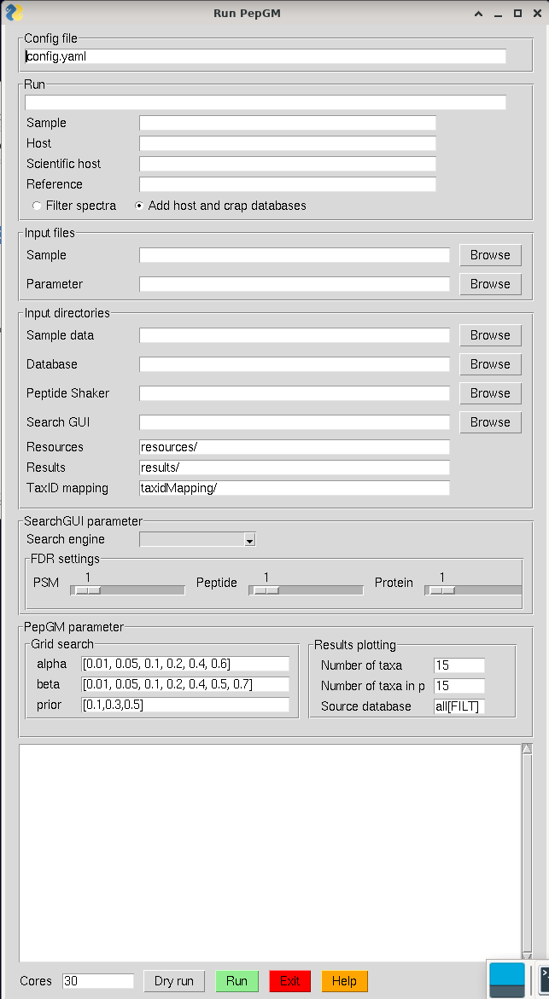

<div id="top"></div>

<!-- PROJECT SHIELDS -->
<!--
*** I'm using markdown "reference style" links for readability.
*** Reference links are enclosed in brackets [ ] instead of parentheses ( ).
*** See the bottom of this document for the declaration of the reference variables
*** for contributors-url, forks-url, etc. This is an optional, concise syntax you may use.
*** https://www.markdownguide.org/basic-syntax/#reference-style-links
-->
<!-- PROJECT LOGO -->
<br />
<div align="center">
  <a href=https://git.bam.de/tholstei/pepgm/>
    
  </a>

<h3 align="center">PepGM</h3>

  <p align="center">
    A probabilistic graphical model for taxonomic inference of viral proteome samples with associated confidence scores
    <br />
    <a href="https://github.com/BAMeScience/repo_name"><strong>Explore the docs »</strong></a>
    <br />
    <br />
    <a href="https://github.com/BAMeScience/repo_name">View Demo</a>
    ·
    <a href="https://github.com/BAMeScience/repo_name/issues">Report Bug</a>
    ·
    <a href="https://github.com/BAMeScience/repo_name/issues">Request Feature</a>
  </p>
</div>


<!-- TABLE OF CONTENTS -->
<details>
  <summary>Table of Contents</summary>
  <ol>
    <li>
      <a href="#about-the-project">About The Project</a>
      <ul>
        <li><a href="#built-with">Built With</a></li>
      </ul>
    </li>
    <li><a href="#input">Input</a></li>
    <li>
      <a href="#getting-started">Getting Started</a>
      <ul>
        <li><a href="#prerequisites">Prerequisites</a></li>
        <li><a href="#installation">Installation</a></li>
      </ul>
    </li>
    <li><a href="#usage">Usage</a></li>
    <li><a href="#roadmap">Roadmap</a></li>
    <li><a href="#contributing">Contributing</a></li>
    <li><a href="#license">License</a></li>
    <li><a href="#contact">Contact</a></li>
    <li><a href="#acknowledgments">Acknowledgments</a></li>
  </ol>
</details>


<!-- ABOUT THE PROJECT -->
## About The Project

PepGM is a probabilistic graphical model embedded into a snakemake workflow for taxonomic inference of viral proteome samples. PepGM was 
developed by the the eScience group at BAM (Federal Institute for Materials Research and Testing).

The PepGM workflow includes the following steps:

0. Optional host and cRAP filtering step
1. SearchDB cleanup : cRAP DB ist added, host is added (if wanted), duplicate entries are removed using seqkit. generation of target-decoy DB using searchCLI. Susequent peptide search using searchCLI + PeptideShaker. Generation of a a peptide list <br>
2. All descendant strains of the target taxa are queried in the NCBI protein DB  through the NCBI API. scripts: GetTargets.py, CreatePepGMGraph.py and FactorGraphGeneration.py<br>
3. Downloaded protein recordes are digested and queried against the protein ID list to generate a bipartite taxon-peptide graph. scripts: CreatePepGMGraph.py and FactorGraphGeneration.py<br>
4. The bipartite graph is transformed into a factor graph using convolution trees and conditional probability table factors (CPD). scripts: CreatePepGMGraph.py and FactorGraphGeneration.py<br>
5. For different sets of CPD parameters, the belief propagation algorithm is run until convergence to obtain the posterior probabilites of the taxa. scripts: belief_propagation.py and PepGM.py <br>
6. Through an  empirically deduced metric, the ideal parameter set is inferred. script GridSearchAnalysis.py <br>
7. For this ideal parameter set, we output a results barchart and phylogenetic tree view showcasing the 15 best scoring tax. scripts: BarPlotResults, PhyloTreeView.py<br> 

<div align="center">
  <a href=https://git.bam.de/tholstei/pepgm/>
    
    </a>
</div>

If you find PepGM helpful for your research, please cite: insert citation

PepGM uses convolution trees. The code for the convolution trees was developed and is described in: [https://journals.plos.org/plosone/article?id=10.1371/journal.pone.0091507](https://journals.plos.org/plosone/article?id=10.1371/journal.pone.0091507)

<p align="right">(<a href="#top">back to top</a>)</p>

<!-- INPUT -->

## Input
* Your spectrum file in .mgf format
* A fasta reference
* A searchGUI .par parameters file with the database search parameters that can be generated using searchGUI
<p align="right">(<a href="#top">back to top</a>)</p>


<!-- GETTING STARTED -->
## Getting Started

### Prerequisites

PepGM is tested for Linux OS.

PepGM uses SearchGUI-4.1.14 and PeptideShaker-2.2.9
Download the necessary files at the following link:
* SearchGUI : [http://compomics.github.io/projects/searchgui](http://compomics.github.io/projects/searchgui)
* PeptideShaker : [http://compomics.github.io/projects/searchgui](http://compomics.github.io/projects/searchgui)

PepGM is a snakemake workflow. Installing snakemake requires mamba.
PepGM was tested using snakemake 5.10.0. 

To install mamba:
  ```sh
conda install -n <your_env> -c conda-forge mamba
  ```

To install snakemake:
```sh
conda activate <your_env>
mamba create -c conda-forge -c bioconda -n <your_snakemake_env> snakemake
```

### Installation

1. Clone the repo 
   ```sh
   git clone https://github.com/BAMeScience/PepGM.git
   ```
4. Enter your API in `config.js`
   ```js
   const API_KEY = 'ENTER YOUR API';
   ```

<p align="right">(<a href="#top">back to top</a>)</p>


<!-- USAGE EXAMPLES -->
## Usage

### Using the graphical user interface

<div align="center">
  <a href=https://git.bam.de/tholstei/pepgm/>
    
</div>


<p align="right">(<a href="#top">back to top</a>)</p>

### Through the command line

<!-- ROADMAP -->
## Roadmap

- [ ] Damping oscillations
- [ ] Extension to metaproteomics+Unipept


See the [open issues](https://github.com/BAMeScience/repo_name/issues) for a full list of proposed features (and known issues).

<p align="right">(<a href="#top">back to top</a>)</p>


<!-- CONTRIBUTING -->
## Contributing

Contributions are what make the open source community such an amazing place to learn, inspire, and create. Any contributions you make are **greatly appreciated**.

If you have a suggestion that would make this better, please fork the repo and create a pull request. You can also simply open an issue with the tag "enhancement".
Don't forget to give the project a star! Thanks again!

1. Fork the Project
2. Create your Feature Branch (`git checkout -b feature/AmazingFeature`)
3. Commit your Changes (`git commit -m 'Add some AmazingFeature'`)
4. Push to the Branch (`git push origin feature/AmazingFeature`)
5. Open a Pull Request

<p align="right">(<a href="#top">back to top</a>)</p>


<!-- LICENSE -->
## License

Distributed under the MIT License. See `LICENSE.txt` for more information.

<p align="right">(<a href="#top">back to top</a>)</p>


<!-- CONTACT -->
## Contact

Tanja Holstein - [@HolsteinTanja](https://twitter.com/HolsteinTanja) - tanja.holstein@bam.de
Franziska Kistner - [@tba](https://twitter.com/tba) - franziska.kistner@bam.de

Project Link: [https://github.com/BAMeScience/repo_name](https://github.com/BAMeScience/repo_name)

<p align="right">(<a href="#top">back to top</a>)</p>


<!-- ACKNOWLEDGMENTS -->
## Acknowledgments

* [tba](tba)
* [tba](tba)
* [tba](tba)

<p align="right">(<a href="#top">back to top</a>)</p>


<!-- MARKDOWN LINKS & IMAGES -->
<!-- https://www.markdownguide.org/basic-syntax/#reference-style-links -->
[contributors-shield]: https://img.shields.io/github/contributors/BAMeScience/repo_name.svg?style=for-the-badge
[contributors-url]: https://github.com/BAMeScience/repo_name/graphs/contributors
[forks-shield]: https://img.shields.io/github/forks/BAMeScience/repo_name.svg?style=for-the-badge
[forks-url]: https://github.com/BAMeScience/repo_name/network/members
[stars-shield]: https://img.shields.io/github/stars/BAMeScience/repo_name.svg?style=for-the-badge
[stars-url]: https://github.com/BAMeScience/repo_name/stargazers
[issues-shield]: https://img.shields.io/github/issues/BAMeScience/repo_name.svg?style=for-the-badge
[issues-url]: https://github.com/BAMeScience/repo_name/issues
[license-shield]: https://img.shields.io/github/license/BAMeScience/repo_name.svg?style=for-the-badge
[license-url]: https://github.com/BAMeScience/repo_name/blob/master/LICENSE.txt
[linkedin-shield]: https://img.shields.io/badge/-LinkedIn-black.svg?style=for-the-badge&logo=linkedin&colorB=555
[linkedin-url]: https://linkedin.com/in/linkedin_username
[product-screenshot]: images/screenshot.png
[Next.js]: https://img.shields.io/badge/next.js-000000?style=for-the-badge&logo=nextdotjs&logoColor=white
[Next-url]: https://nextjs.org/
[React.js]: https://img.shields.io/badge/React-20232A?style=for-the-badge&logo=react&logoColor=61DAFB
[React-url]: https://reactjs.org/
[Vue.js]: https://img.shields.io/badge/Vue.js-35495E?style=for-the-badge&logo=vuedotjs&logoColor=4FC08D
[Vue-url]: https://vuejs.org/
[Angular.io]: https://img.shields.io/badge/Angular-DD0031?style=for-the-badge&logo=angular&logoColor=white
[Angular-url]: https://angular.io/
[Svelte.dev]: https://img.shields.io/badge/Svelte-4A4A55?style=for-the-badge&logo=svelte&logoColor=FF3E00
[Svelte-url]: https://svelte.dev/
[Laravel.com]: https://img.shields.io/badge/Laravel-FF2D20?style=for-the-badge&logo=laravel&logoColor=white
[Laravel-url]: https://laravel.com
[Bootstrap.com]: https://img.shields.io/badge/Bootstrap-563D7C?style=for-the-badge&logo=bootstrap&logoColor=white
[Bootstrap-url]: https://getbootstrap.com
[JQuery.com]: https://img.shields.io/badge/jQuery-0769AD?style=for-the-badge&logo=jquery&logoColor=white
[JQuery-url]: https://jquery.com 