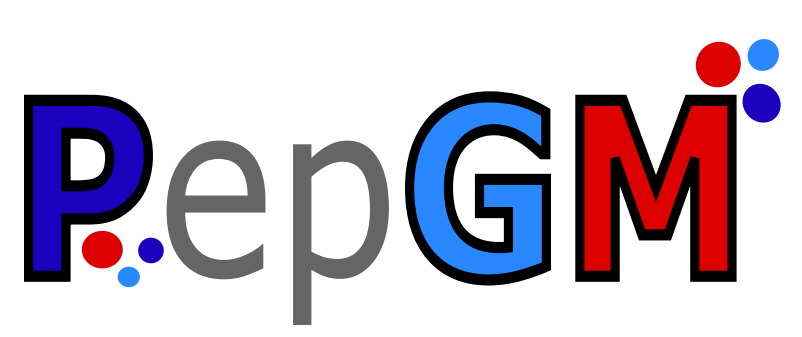
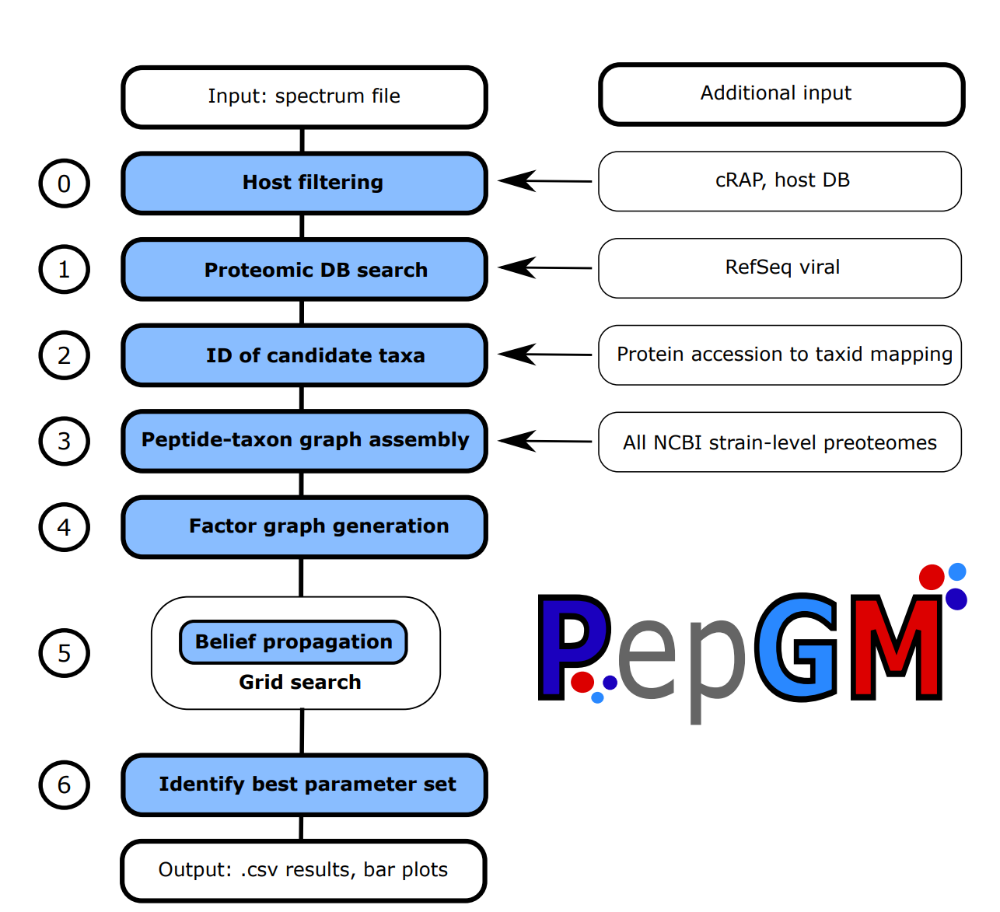

<div id="top"></div>


<!-- PROJECT SHIELDS -->
<!--
*** I'm using markdown "reference style" links for readability.
*** Reference links are enclosed in brackets [ ] instead of parentheses ( ).
*** See the bottom of this document for the declaration of the reference variables
*** for contributors-url, forks-url, etc. This is an optional, concise syntax you may use.
*** https://www.markdownguide.org/basic-syntax/#reference-style-links
-->
<!-- PROJECT LOGO -->
<br />
<div align="center">
  <a href=https://git.bam.de/tholstei/pepgm/>
    
  </a>

<h3 align="center">PepGM</h3>

  <p align="center">
    A probabilistic graphical model for taxonomic inference of viral proteome samples with associated confidence scores
    <br />
  </p>
</div>


<!-- TABLE OF CONTENTS -->
<details>
  <summary>Table of Contents</summary>
  <ol>
    <li>
      <a href="#about-the-project">About The Project</a>
      <ul>
      </ul>
    </li>
    <li><a href="#input">Input</a></li>
    <li>
      <a href="#getting-started">Getting Started</a>
      <ul>
        <li><a href="#prerequisites">Prerequisites</a></li>
        <li><a href="#installation">Installation</a></li>
        <li><a href="#preparation">Preparation</a></li>
      </ul>
    </li>
    <li><a href="#usage">Usage</a></li>
    <li><a href="#roadmap">Roadmap</a></li>
    <li><a href="#contributing">Contributing</a></li>
    <li><a href="#license">License</a></li>
    <li><a href="#contact">Contact</a></li>
  </ol>
</details>


<!-- ABOUT THE PROJECT -->
## About The Project

### Our preprint is out now! You can read it [here](https://www.biorxiv.org/content/10.1101/2022.09.21.508832v1).

PepGM is a probabilistic graphical model embedded into a snakemake workflow for taxonomic inference of viral proteome samples. PepGM was 
developed by the the eScience group at BAM (Federal Institute for Materials Research and Testing).


The PepGM workflow includes the following steps:

0. Optional host and cRAP filtering step
1. SearchDB cleanup : cRAP DB ist added, host is added (if wanted), duplicate entries are removed using [seqkit](https://bioinf.shenwei.me/seqkit/). generation of target-decoy DB using searchCLI. Susequent peptide search using searchCLI + PeptideShaker. Generation of a a peptide list <br>
2. All descendant strains of the target taxa are queried in the NCBI protein DB  through the NCBI API. scripts: GetTargets.py, CreatePepGMGraph.py and FactorGraphGeneration.py<br>
3. Downloaded protein recordes are digested and queried against the protein ID list to generate a bipartite taxon-peptide graph. scripts: CreatePepGMGraph.py and FactorGraphGeneration.py<br>
4. The bipartite graph is transformed into a factor graph using convolution trees and conditional probability table factors (CPD). scripts: CreatePepGMGraph.py and FactorGraphGeneration.py<br>
5. For different sets of CPD parameters, the belief propagation algorithm is run until convergence to obtain the posterior probabilites of the taxa. scripts: belief_propagation.py and PepGM.py <br>
6. Through an  empirically deduced metric, the ideal parameter set is inferred. script GridSearchAnalysis.py <br>
7. For this ideal parameter set, we output a results barchart and phylogenetic tree view showcasing the 15 best scoring tax. scripts: BarPlotResults, PhyloTreeView.py<br> 

<div align="center">
  <a href=https://git.bam.de/tholstei/pepgm/>
    
    </a>
</div>

<br>

If you find PepGM helpful for your research, please cite: <br>
_PepGM: A probabilistic graphical model for taxonomic inference of viral proteome samples with associated confidence scores  <br>_
Tanja Holstein, Franziska Kistner, Lennart Martens, Thilo Muth <br>
bioRxiv 2022.09.21.508832 <br>
doi: https://doi.org/10.1101/2022.09.21.508832

PepGM uses convolution trees. The code for the convolution trees was developed and is described in: [https://journals.plos.org/plosone/article?id=10.1371/journal.pone.0091507](https://journals.plos.org/plosone/article?id=10.1371/journal.pone.0091507)<br>
PepGM uses a version of the belief propagatin algorithm with a graphical network architecture previously described in [https://pubs.acs.org/doi/10.1021/acs.jproteome.9b00566](https://pubs.acs.org/doi/10.1021/acs.jproteome.9b00566)

<p align="right">(<a href="#top">back to top</a>)</p>

<!-- INPUT -->

## Input
* Your spectrum file in .mgf format
* A reference database in fasta format (see <a href="#preparation">Preparation</a>) <br>
* A searchGUI .par parameters file with the database search parameters that can be generated using searchGUI

Additonally, you need:
* NCBI Entrez account

<p align="right">(<a href="#top">back to top</a>)</p>

<!-- GETTING STARTED -->
## Getting Started

### Prerequisites

Make sure you have git installed and clone the repo:
   ```sh
   git clone https://github.com/BAMeScience/PepGM.git
   ```
PepGM is a snakemake workflow developed with snakemake 5.10.0. <br>
Installing snakemake requires mamba.

To install mamba:
  ```sh
conda install -n <your_env> -c conda-forge mamba
  ```

To install snakemake:
```sh
conda activate <your_env>
mamba create -c conda-forge -c bioconda -n <your_snakemake_env> snakemake
```
In accordance with the Snakemake recommendations, we suggest to save your sample data 
in `resources` folder. All outputs will be saved in `results`.

Additional dependencies necessary are Java and GCC.

PepGM is tested for Linux OS and uses SearchGUI-4.1.14 and PeptideShaker-2.2.9 developed 
by the CompOmics group at University of Ghent. <br>

Download the necessary files at the following link:
* SearchGUI : [http://compomics.github.io/projects/searchgui](http://compomics.github.io/projects/searchgui)
* PeptideShaker : [http://compomics.github.io/projects/peptide-shaker.html](http://compomics.github.io/projects/peptide-shaker.html)

We suggest to create a new directory `bin` inside your PepGM 
working directory and save the SearchGUI and PeptideShaker binaries there:

```shell
mkdir ./bin && cd bin
wget https://genesis.ugent.be/maven2/eu/isas/searchgui/SearchGUI/4.1.23/SearchGUI-4.1.23-mac_and_linux.tar.gz
wget https://genesis.ugent.be/maven2/eu/isas/peptideshaker/PeptideShaker/2.2.16/PeptideShaker-2.2.16.zip
tar -xvf SearchGUI-4.1.23-mac_and_linux.tar.gz && unzip PeptideShaker-2.2.16.zip
```
You can delete the .zip files afterwards:
```shell
rm *.tar.gz && rm *.zip
```
<p align="right">(<a href="#top">back to top</a>)</p>

## Preparation

### Downloading reference database
We recommend using the RefSeq Viral database as a generic reference database. It can be downloaded from the NCBI ftp:

  ```sh
  cd ./resources/Database
  wget ftp://ftp.ncbi.nlm.nih.gov/refseq/release/viral/\*.protein.faa.gz &&
  gzip -d viral.*.protein.faa.gz &&
  cat viral.*.protein.faa> refSeqViral.fasta &&
  rm viral.*.protein.faa
  ```
### Using the NCBI Entrez API 
PepGM uses the NCBI Entrez API. <br>
We strongly advise you to create an NCBI account with your own key due to drastic speed increase.
Find out how to obtain your NCBI API key [here](https://support.nlm.nih.gov/knowledgebase/article/KA-05317/en-us). <br>

### Generating a SearchGUI parameters file
As PepGM relies on SearchGUI to perform the database search, a SearchGUI parameters file, 
specifying the database search parameters, has to be provided. 
The easiest way to generate this file is via the GUI provided by SearchGUI. 
Other than that, 
the CLI instructions to set SearchGUI parameters are described 
[here](http://compomics.github.io/projects/searchgui#user-defined-modifications).

<p align="right">(<a href="#top">back to top</a>)</p>

<!-- USAGE EXAMPLES -->
## Usage

### Configuration file 
PepGM needs a configuration file in `yaml` format to set up the workflow. 
An exemplary configuration file is provided in `config/config.yaml`. <br>
Please insert your NCBI account details (mail & key) and provide the required absolute paths to
* SamplePath
* ParametersFile
* SearchGUI & PeptideShaker binaries (SearchGUIDir & PeptideShakerDir)

Do not change the config file location.
<details>
  <summary>Details on the configuration parameters </summary> <br>
    <details> <summary>Run panel <br> </summary> 
    Set up the workflow of your PepGM run by providing parameters that fill wildcards to locate input files
    such as raw spectra or reference database files. Thus, use file basenames i.e., without file 
    suffix, that your files already have or rename them accordingly. <br><br>
    Run: Name of your run that is used to create a subfolder in the results directory. <br>
    Sample: Name of your sample that is used to create a subfolder in the run directory. <br> 
    Reference: Name of reference database (e.g. human). <br>
    Host: Trivial host name. <br>
    Scientific host: Scientific host name. Retain (scientific) host names from public libraries such as 
    <a href="http://www.proteomexchange.org/">ProteomeXchange</a> or 
    <a href="https://www.ebi.ac.uk/pride/">PRIDE</a> (e.g. homo sapiens). <br>
    Add host and crap database: Search database is extended by a host and
    <a href="https://www.thegpm.org/crap/">cRAP</a> database. Mutually exclusive to Filter Spectra.  <br><br> </details>
    <details> <summary>Input panel <br> </summary> 
    Specify input file and directory paths. <br><br>
    Sample spectra: Path to raw spectra file. <br>   
    Parameter: Path to SearchGUI parameter file. <br>
    Sample data: Path to directory that contains sample raw spectra files. <br>
    Database: Path to directory that contains the reference database. <br>
    Peptide Shaker: Path to PeptideShaker binary (.jar). <br>
    Search GUI (folder): Path to SearchGUI binary (.jar). <br><br>
    The following paths are part of the recommended project structure for Snakemake workflows. Find out more about
    reproducible Snakemake workflows
    <a href="https://snakemake.readthedocs.io/en/stable/snakefiles/deployment.html">here</a>. <br>
    Resources: Relative path to resources folder <br>
    Results: Relative path to results folder <br>
    TaxID mapping: Relative path to folder that contains mapped taxIDs. <br> <br>
    </details>
    <details> <summary>Search panel <br> </summary> 
    Choose a search engine that SearchGUI is using and the desired FDR levels. <br><br>
    </details>
    <details> <summary>PepGM panel <br></summary>
    Grid search: Choose increments for alpha, beta and prior that are to be included in the grid search to tune
    graphical model parameters. Do not put a comma between values. <br>
    Results plotting: Number of taxa in the final strain identification barplot. <br><br> 
    </details>
    <details> <summary>Config file panel <br> </summary>    
    Provide your NCBI API mail and key.
    </details>

</details>

### Using the graphical user interface
The graphical user interface (GUI) is developed to run Snakemake workflows without modifying 
the configuration file manually in a text editor. <br>
You can write a config file from scratch or edit an existing config file.
When modifying the config file in between runs, make sure to press the Write button before running.
<br>

### Through the command line

PepGM can also be run from the command line. To run the snakemake workflow, 
you need to be in your PepGM repository and have the Snakemake conda environment activated. 
Run the following command 
```sh
  snakemake --use-conda --conda-frontend conda --cores <n_cores> 
  ```
Where `n_cores` is the number of cores you want snakemake to use. 
<p align="right">(<a href="#top">back to top</a>)</p>

### Output files

All PepGM output files are saved into the results folder and include the following: <br>

Main results: <br>
- PepGM_Results.csv: Table with values ID, score, type (contains all taxids under 'ID' and all probabilities under 'score' that were attributed by PepGM) <br>
- PepGM_ResultsPlot.png: Posterior probabilities of n (default: 15) highest scoring taxa <br>
- PhyloTreeView.png : n (default: 1 5) highest scoring taxa including their score visualized in a taxonomic tree <br>

Additional (intermediate): <br>
- Intermediate results folder sorted by their prior value for all possible grid search parameter combinations
- mapped_taxids_weights.csv: csv file of all taxids that had at least one protein map to them and their weight 
- PepGM_graph.graphml: graphml file of the graphical model (without convolution tree factors). Useful to visualize the graph structure and peptide-taxon connections <br>
- paramcheck.png: barplot of the metric used to determine the graphical model parameters for n (default: 15) best performing parameter combinations <br>
- log files for bug fixing

## Toy example
We have provided a toy example (<a href="https://www.ebi.ac.uk/pride/archive/projects/PXD014913">Cowpox virus Brighton Red</a>) to ease the first steps with PepGM. You will find a reduced 
viral reference database only containing peptides from cowpow and cowpox-related strains,
a SearchGUI parameter file and the host and cRAP peptide sequence database in `/resources`. The cowpox MS2
spectra can be downloaded 
<a href="https://ftp.pride.ebi.ac.uk/pride/data/archive/2020/05/PXD014913/CPXV-0,1MOI-supernatant-HEp-24h.mgf">here</a> (PRIDE ftp archive).
Download the spectra file to `/resources/SampleData/`

```
wget https://ftp.pride.ebi.ac.uk/pride/data/archive/2020/05/PXD014913/CPXV-0,1MOI-supernatant-HEp-24h.mgf
mv CPXV-0,1MOI-supernatant-HEp-24h.mgf spectrafile_PXD014913_cowpox_minimal_example.mgf
    
```

and adopt the reference database file basename in corresponding configuration parameter to minRefSeqViral. Finally, 
insert your API key and mail and replace the path to SamplePath, ParameterFile, SearchGUI and PeptideShaker with your
individual locations.

<p align="right">(<a href="#top">back to top</a>)</p>

<!-- ROADMAP -->
## Roadmap

- [ ] Damping oscillations
- [ ] Extension to metaproteomics+Unipept


See the [open issues](https://github.com/BAMeScience/repo_name/issues) for a full list of proposed features (and known issues).

<p align="right">(<a href="#top">back to top</a>)</p>


<!-- CONTRIBUTING -->
## Contributing

Contributions are what make the open source community such an amazing place to learn, inspire, and create. Any contributions you make are **greatly appreciated**.

If you have a suggestion that would make this better, please fork the repo and create a pull request. You can also simply open an issue with the tag "enhancement".
Don't forget to give the project a star! Thanks again!

1. Fork the Project
2. Create your Feature Branch (`git checkout -b feature/AmazingFeature`)
3. Commit your Changes (`git commit -m 'Add some AmazingFeature'`)
4. Push to the Branch (`git push origin feature/AmazingFeature`)
5. Open a Pull Request

<p align="right">(<a href="#top">back to top</a>)</p>


<!-- LICENSE -->
## License

Distributed under the MIT License. See `LICENSE.txt` for more information.

<p align="right">(<a href="#top">back to top</a>)</p>


<!-- CONTACT -->
## Contact

Tanja Holstein - [@HolsteinTanja](https://twitter.com/HolsteinTanja) - tanja.holstein@bam.de <br>
Franziska Kistner - [LinkedIn](https://www.linkedin.com/in/franziska-kistner-58a57b18b) - franziska.kistner@bam.de

<p align="right">(<a href="#top">back to top</a>)</p>


<!-- MARKDOWN LINKS & IMAGES -->
<!-- https://www.markdownguide.org/basic-syntax/#reference-style-links -->
[contributors-shield]: https://img.shields.io/github/contributors/BAMeScience/repo_name.svg?style=for-the-badge
[contributors-url]: https://github.com/BAMeScience/repo_name/graphs/contributors
[forks-shield]: https://img.shields.io/github/forks/BAMeScience/repo_name.svg?style=for-the-badge
[forks-url]: https://github.com/BAMeScience/repo_name/network/members
[stars-shield]: https://img.shields.io/github/stars/BAMeScience/repo_name.svg?style=for-the-badge
[stars-url]: https://github.com/BAMeScience/repo_name/stargazers
[issues-shield]: https://img.shields.io/github/issues/BAMeScience/repo_name.svg?style=for-the-badge
[issues-url]: https://github.com/BAMeScience/repo_name/issues
[license-shield]: https://img.shields.io/github/license/BAMeScience/repo_name.svg?style=for-the-badge
[license-url]: https://github.com/BAMeScience/repo_name/blob/master/LICENSE.txt
[linkedin-shield]: https://img.shields.io/badge/-LinkedIn-black.svg?style=for-the-badge&logo=linkedin&colorB=555
[linkedin-url]: https://linkedin.com/in/linkedin_username
[product-screenshot]: images/screenshot.png
[Next.js]: https://img.shields.io/badge/next.js-000000?style=for-the-badge&logo=nextdotjs&logoColor=white
[Next-url]: https://nextjs.org/
[React.js]: https://img.shields.io/badge/React-20232A?style=for-the-badge&logo=react&logoColor=61DAFB
[React-url]: https://reactjs.org/
[Vue.js]: https://img.shields.io/badge/Vue.js-35495E?style=for-the-badge&logo=vuedotjs&logoColor=4FC08D
[Vue-url]: https://vuejs.org/
[Angular.io]: https://img.shields.io/badge/Angular-DD0031?style=for-the-badge&logo=angular&logoColor=white
[Angular-url]: https://angular.io/
[Svelte.dev]: https://img.shields.io/badge/Svelte-4A4A55?style=for-the-badge&logo=svelte&logoColor=FF3E00
[Svelte-url]: https://svelte.dev/
[Laravel.com]: https://img.shields.io/badge/Laravel-FF2D20?style=for-the-badge&logo=laravel&logoColor=white
[Laravel-url]: https://laravel.com
[Bootstrap.com]: https://img.shields.io/badge/Bootstrap-563D7C?style=for-the-badge&logo=bootstrap&logoColor=white
[Bootstrap-url]: https://getbootstrap.com
[JQuery.com]: https://img.shields.io/badge/jQuery-0769AD?style=for-the-badge&logo=jquery&logoColor=white
[JQuery-url]: https://jquery.com 